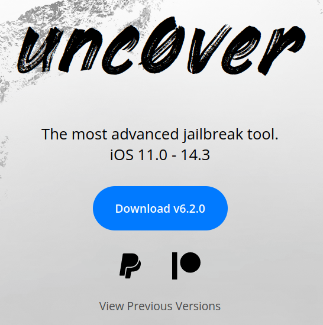
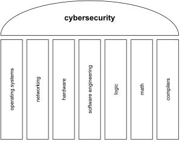

# Introduction to Systems Security

## Why we are here

{fig-align="center"}

Source: <https://unc0ver.dev/>

Question: what does it take to get from a tapped button to full control of a device?

## The more things change

* OWASP Top 10, 2003 to 2021: injection, XSS, broken authentication, misconfiguration
* the same classes keep coming back

Question: why do they survive two decades?

## System / application cybersecurity

{fig-align="center"}

## Scenarios

Pick one and play the attacker: goals, threat model, attack vector.

* an iOS device
* a social network
* a bank website
* the national power grid

Question: what would the defender do: prevent, isolate, react?

## Security vs. safety

* safety is a state, security is a process
* the umbrella versus staying warm and dry

Question: is a system that has never been attacked secure?

## The A* chain

* authentication: `login`
* authorization: `chmod`
* access control: `ls`
* audit: `find`, `auditd`

Question: which of the four would you check first on a machine you do not trust?

## Least privilege and the TCB

* give each subject only the permissions it needs
* bugs in the trusted computing base compromise everything
* aim to shrink both

Question: which parts of your laptop are in the TCB?

## Vulnerability, exploit, attack vector

* vulnerability: the weakness
* exploit: the method that uses it
* attack vector: the chain of steps to the outcome

Question: where does the attack surface end?

## Defense phases

* harden
* prevent
* confine
* treat
* monitor, throughout

Question: for a stack buffer overflow, which phase do ASLR, DEP and ASan belong to?

## Defense in depth

Assume one layer falls and another takes its place.

Question: what is the last layer in your own setup?

## Keywords

systems security, goals, safety, trust, trusted computing base, least privilege, threat model, vulnerability, exploit, attack vector, attack surface, defense in depth, harden, prevent, confine, treat, monitor.
