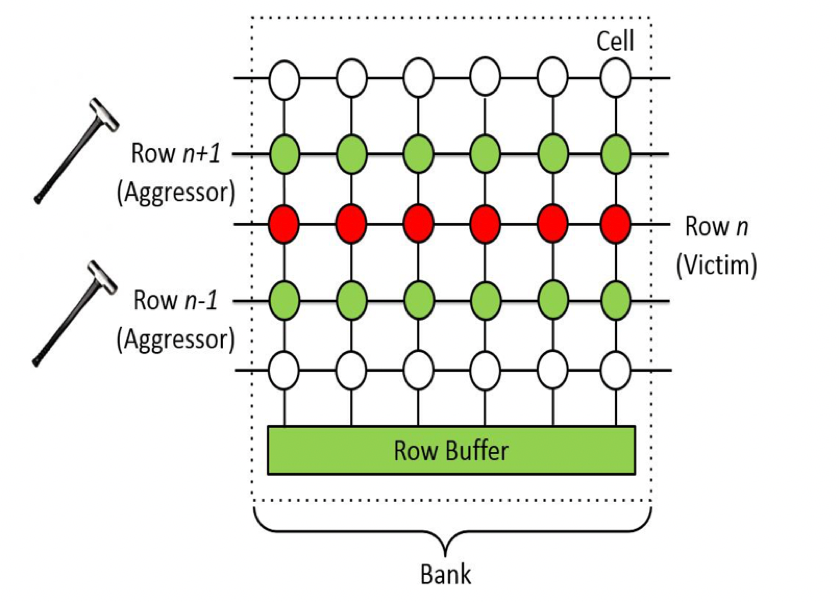

# Exploiting Web Applications and the OS

## Web App Architecture

> **TODO (figure):** front end, back end, database, and the common targets (hosting server, other servers, privileged and other users), from slides.tex (text-only frames)

## Attack Vectors

* HTTP protocol
* URL: GET and POST
* file upload
* other users

Question: which of these does the lab application expose?

## Injection: Demo

Demo: break a query by editing a URL parameter.

* what did the server do with our input?
* what would the safe version look like?

## XSS: Three Kinds

* reflected XSS
* stored XSS
* DOM XSS

Question: where does the payload live in each case?

## Broken Access Control: Demo

Demo: browse to an authenticated page as an unauthenticated user.

Question: which check was missing, and on which side?

## From Web to OS

* web server compromise gives code execution as the service user
* next step: local privilege escalation
* tools: exploitdb, Linux Exploit Suggester, Metasploit

## OS Exploiting

* information leak
* local privilege escalation
* remote command execution
* resource exhaustion

Question: how would you rank these by impact?

## Rowhammer

{fig-align="center"}

## Meltdown and Spectre

* speculative execution plus a cache side channel
* arbitrary memory access
* no software bug to patch in the application

Question: why can software not fully fix this?

## Takeaways

* every input is an attack vector
* defences at one layer do not cover the layers below
* patching components is part of security
