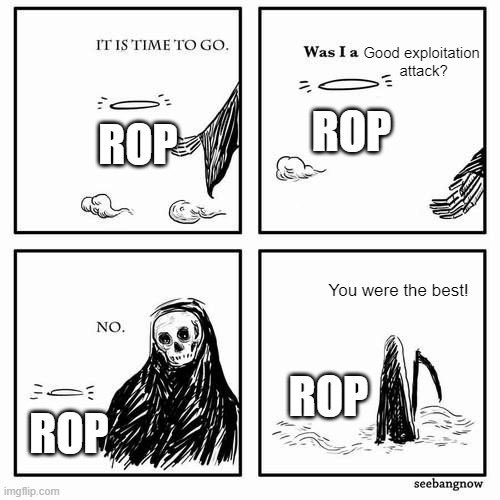

# Defense and Mitigation

## Rop Meme

{fig-align="center"}

Source: <https://x.com/__L4w__/status/1719684484969152841>

## Attack and Defense

* attack: exploit vulnerabilities
* defense: prevent attacks, make attacks difficult, confine attacks
* attacker needs to find one security hole
* defender has to protect all security holes
* attacker invests time
* defense mechanisms incur overhead

## Papers

* [Mitigating Program Security Vulnerabilities: Approaches and Challenges](https://dl.acm.org/doi/abs/10.1145/2187671.2187673)
* [Securing Web Application Code by Static Analysis and Runtime Protection](https://dl.acm.org/doi/abs/10.1145/988672.988679)

# Attacker Perspective

## Attacker Goals

* control
* cripple
* steal

## Exploit

* determine entries/input
* graph/automaton describes system/application behavior
* subvert graph
  * add new nodes (inject)
  * add new edges
  * use existing paths in a different way

## Attack Vector

* chain together multiple exploits
* gain access, gain privileged access, cripple, steal
* use vulnerabilities in software, system, web

# Defender Perspective

## Time

* always on the attacker side
* prevent attacks is better than handling attacks

## System Components

* protect everything
* attacker need only find **one** flaw
* defense in depth

## Prevention

* preventive/proactive is better than reactive
* harden system components
* monitor everything

## Security vs Speed

* any defense mechanism incurs overhead
* use both offline (check at development time) and online mechanisms (check/harden during run-time)

## Handling Complexity

* automate processes
* verification and validation
* check before deployment
* prioritize critical parts

## Monitoring

* paranoia is a virtue
* frequent updates
* be on the lookout for CVEs

# Generic Defensive Techniques

## Defensive Steps

* prevent existence and prevent exploitation
* during development
* before deployment
* during deployment: prevent, react, confine

## Prevent Existence

* prevent existence of bugs and vulnerabilities
* during development and before deployment
* Secure Software Development
* secure coding, defensive programming
* code auditing, code linting
* fuzzing, symbolic execution

## Prevent Exploitation

* during deployment
* if vulnerabilities exist, you cannot exploit them
* either prevent or make it harder for the attacker
* harden the application, the system

## Making Exploitation Harder

* randomize
* obfuscate
* break application into multiple apps
* reduce number of inputs (attack surface)

## Preventing Exploitation

* make memory areas inaccessible
* isolate components
* harden executable with checker and sanitizers during runtime
* disadvantage: incurs overhead

## Confine

* more in session 7: Application Confinement
* **when** the attack happens, reduce damage
* sandboxing, permissions
* treat application as potential malware

## React

* monitor applications, system
* when attack happens, document, make app/system inaccessible
* patch as soon as possible
* investigate, prevent future similar attacks

# Application Defense

## Mindset

* application is target of attacker
* input minimization, input validation
* you deploy an app that may have flaws or may be malware
* memory disclosure attacks, application control

## Goal

* prevent control flow hijacking
* prevent memory/information disclosure
* be on the look for policy flaws that may allow the app to leak information

## CFI

* *Control Flow Integrity*
* make sure control flow graph is unchanged during run
* high overhead
* fine-grained vs coarse grained CFI

## Code Pointers

* critical memory data
* target for attacker for control flow hijacking
* function return addresses, function pointers
* *Code Pointer Integrity* (faster approach to CFI), next lecture

## Prevent Vulnerabilities vs Prevent Exploiting vs Make Unlikely vs Confine

* prevent vulnerabilities: secure coding, verification, fuzzing, symbolic execution, type safety, safe programming languages (later sessions)
* prevent exploiting: ASan, StackGuard (canaries), SafeStack, CFI, input validation, DEP
* make unlikely: ASLR, multiple heaps
* confine: sandboxing, privacy settings, access control settings, SFI (*Software Fault Isolation*) (later sessions)

## Stack Guard / Address Sanitizer

* stack canary, stack protector
* added at compile time
* value (canary) placed between buffer and return address
* overwriting canary is detected and ends the program
* may leak canary and overwrite it with itself
* may overwrite other data (without overwriting canary)
* may overwrite stack guard exit handler
* Google Address Sanitizer adds multiple checks, albeit at increased overhead

## Input Validation

* assume input is "evil"
* prevent injection: command injection, SQL injection, shellcode injection
* prevent attacks such as billion laughs attacks
* prevent certain patterns, parse input

## CFI in Practice

* monitor control graph
* monitor calls, jumps, branches
* aim to do it without incurring significant overhead
* may happen offline

## SafeStack

* store code pointers in a separate stack
* buffer overflows will not overflow code pointers
* provide specific methods to access safe stack data

## DEP

* Data Execution Prevention
* mark writable memory area as non-executable
* you cannot write and execute, i.e. inject code
* data, heap, stack are marked with DEP
* may be bypassed by using a `mprotect()`-like call to update memory area permissions

## ASLR

* Address Space Layout Randomization
* new memory sections (especially libraries) are loaded at random addresses
* makes it difficult to find addresses
* not that effective on i386; useful on x86_64
* may be bypassed by information leaking

# Web Application Defense

## General

* secure configuration
* input sanitization
* trusted connection
* no vulnerable dependencies

## Verification

* client side
* server side

## Connection

* HTTPS, SSL/TLS
* certificate
* downgrade attacks

## Secure HTTP Headers

* HTTP Strict Transport Security (HSTS)
* X-Frame-Options
* X-XSS-Protection
* X-Content-Type-Options
* Content-Security-Policy
* Referrer-Policy
* Expect-CT

## Database Protection

* **sanitize** queries
* encrypt data at rest
* encrypt data in transit
* **sanitize** queries

# Operating System Defense

## General System Defense

* IDS: Intrusion Detection System
* IPS: Intrusion Prevention System

## Signing

* secure boot
* application signing

## Sandboxing

* MAC: Mandatory Access Control
  * SELinux
  * SMACK
  * AppArmor
  * TOMOYO
* seccomp

## Kernel Config

* `CONFIG_HARDENED_USERCOPY`
* `CONFIG_FORTIFY_SOURCE`
* `CONFIG_RANDOMIZE_BASE` (KASLR)
* `CONFIG_KASAN`
* `CONFIG_UBSAN`
* `CONFIG_KCSAN`
* `CONFIG_KMSAN` (with Clang >= 14.0.6)
* in development: KTSAN
* grsecurity

# Summary

## Defensive Mechanisms

* prevent existence, prevent exploitation
* development, before deployment, during deployment
* input is the root of all evil
* look out for control flow hijacks, information leaks, malformed input

## Keywords

::: {.columns}
::: {.column width="50%"}
* vulnerability
* exploit
* attack vector
* prevention
* isolation
* CFI
* code pointer
* Stack Guard
:::
::: {.column width="50%"}
* DEP
* ASLR
* Address Sanitizer
* downgrade attacks
* secure HTTP headers
* sandboxing
* Mandatory Access Control
:::
:::

## Resources

* [Let's Encrypt](https://letsencrypt.org/)
* [Defeating SSL Using Sslstrip](https://www.youtube.com/watch?v=MFol6IMbZ7Y)
* [OWASP Secure Headers Project](https://www.owasp.org/index.php/OWASP_Secure_Headers_Project)
