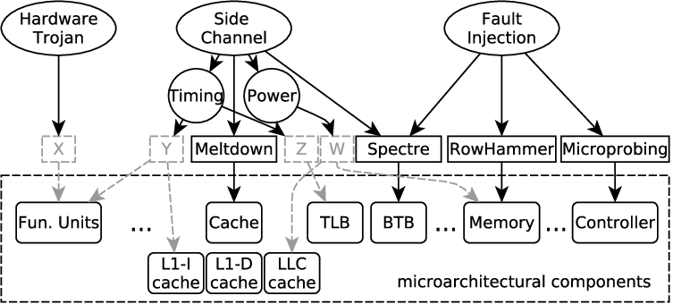

# Modern Offensive and Defensive Solutions

## Papers

* [HCFI: Hardware-enforced Control-Flow Integrity](https://dl.acm.org/doi/abs/10.1145/2857705.2857722)
* [Losing Control: On the Effectiveness of Control-Flow Integrity under Stack Attacks](https://dl.acm.org/doi/abs/10.1145/2810103.2813671)

## Attack and Defense

* attack: exploit vulnerabilities
* defense: prevent attacks, make attacks difficult, confine attacks
* the attacker needs to find one security hole
* the defender has to protect all security holes
* the attacker invests time
* defense mechanisms incur overhead

## Attacker Perspective and Mindset

* find one vulnerability and build from that
* look for something that is valuable
* do reconnaissance, look for weak spots
* create an attack chain
* use every trick in the book
* start from existing knowledge

## Defender Perspective and Mindset

* protect all entry points
* users are vulnerable, as well as technology
* use multiple defensive layers
* monitor, be proactive
* discipline and best practices are worth more than skills
* invest more on valuable targets

## Attacker Pros/Cons

* apart from ethical hackers and security researchers, it is a shady business
* you may not need skills, just a weak target and a database of attack vectors
* you may get caught
* you only need to find one spot
* possible great gains
* little time for fame (anonymous)
* the Internet gives you tons of targets
* but many targets give little more than fun

## Defender Pros/Cons

* fewer resources (time) than an attacker
* must think of everything
* is being paid constructively
* you have a purpose: keep the system running
* it never ends

## Honeypots

* baits
* a system appearing as vulnerable but closely monitored
* deflect, change attention and collect attacker information

# Modern Application Security

## Evolution of Application Security

* buffer overflows
* shellcodes
* memory protection (DEP, W^X)
* memory randomization
* canaries
* code reuse
* CFI (Control Flow Integrity)
* memory safety, safe programming languages
* static and dynamic analysis
* hardware enhanced security

## Fine-grained ASLR

* paper: <https://dl.acm.org/citation.cfm?id=2498135>
* issue with ASLR: memory disclosure / information leak
* one leaked address reveals all information
* the fix: randomize at page level
* one leak may lead to other leaks that are chained together

## SafeStack

* <https://clang.llvm.org/docs/SafeStack.html>
* part of the Code Pointer Integrity project: <http://dslab.epfl.ch/proj/cpi/>
* moves sensitive information (such as return addresses) on a safe stack, leaving problematic ones on the unsafe stack
* reduced overhead, protects against stack buffer overflows
* microStache: <https://www.springerprofessional.de/en/microstache-a-lightweight-execution-context-for-in-process-safe-/16103742>

## Address Sanitizer

* ASan
* paper: <https://research.google.com/pubs/archive/37752.pdf>
* code: <https://github.com/google/sanitizers/>
* instruments code
* only useful in development
* detects out-of-bounds bugs, memory leaks

## CFI/CPI

* <https://dl.acm.org/citation.cfm?id=1102165>
* <https://www.usenix.org/node/186160>
* <http://dslab.epfl.ch/proj/cpi/>
* coarse-grained CFI vs fine-grained CFI
* Control Flow Integrity, Code Pointer Integrity
* protect against control flow hijack attacks
* CPI is weaker than CFI but more practical (reduced overhead)
* CPI protects all code pointers, data based attacks may still happen
* CPS (Code Pointer Separation) is a weaker yet more practical form of CPI

## Shellcodes

* difficult to inject due to DEP, small buffers and input validation
* preliminary parts of the attack may remap a memory region
* shellcode may do stack pivoting and then load another shellcode
* alphanumeric shellcodes: still need a binary address to bootstrap

## Code Reuse

* bypass DEP by using existing pieces of code
* code gadgets
* used in ROP (*Return-Oriented Programming*) and JOP (*Jump-Oriented Programming*)

## Return-Oriented Programming

* gadgets ending in `ret`
* may be chained together to form an attack
* Turing-complete language
* <http://www.suse.de/~krahmer/no-nx.pdf>
* <https://dl.acm.org/citation.cfm?id=2133377>
* most common way of creating runtime attack vectors
* JOP: <https://dl.acm.org/citation.cfm?id=1966919>
  * gadgets end in an indirect branch, not a `ret`

## Anti-ROP Defense

* prevent attacks
  * SafeStack
  * CFI/CPI, ASan
  * Microsoft CFG, RFG
* detect attacks
  * Microsoft EMET (*Enhanced Mitigation Experience Toolkit*), ProcessMitigations module

## Intel CET

* **shadow stack**
  * save the return address on both the normal stack and the shadow stack
  * on return check both stacks
  * if the return addresses differ, crash
* **indirect branch tracking**
  * protect against redirection
  * the compiler marks valid jump spots
  * the CPU validates jump spots
* implemented in hardware
* support required from applications and operating system

> **TODO (figure):** shadow stack versus normal stack on function return (not in the Beamer source; optional illustration), from slides.tex

## Data-Oriented Attacks

* <https://www.usenix.org/node/190963>
* <https://huhong-nus.github.io/advanced-DOP/>
* overwrite data, not code pointers
* bypass CFI

# Modern OS Security

## Evolution of OS Security

* traditional main goals: functionality and reduced overhead
* recent focus on OS security: plethora of devices and use cases
* malware may easily take place among legitimate applications
* kernel exploits become more common
* OS virtualization, reduce the TCB to the hypervisor
* include hardware-enforced security features

## Mandatory Access Control

* as opposed to Discretionary Access Control, where the owner controls permissions
* system-imposed settings
* increased, centralized security
* difficult to configure and maintain
* rigid, non-elastic
* Bell-LaPadula Model: <http://csrc.nist.gov/publications/history/bell76.pdf>
* SELinux, TrustedBSD, Mandatory Integrity Control

## Role-Based Access Control

* <https://ieeexplore.ieee.org/abstract/document/485845>
* <https://dl.acm.org/citation.cfm?id=266751>
* aggregate permissions into roles
* role assignment, role authorization, permission authorization
* useful in organizations

## Sandboxing

* assume the application may be malware
* reduce potential damage
* confine access to a minimal set of allowed actions
* typically implemented at sandbox level (kernel enforced)
* iOS sandboxing, Linux seccomp

## Application Signing

* ensure the application is validated
* used by application stores and repositories: Google Play, Apple App Store
* the device may refuse to run unsigned apps

## iOS Jekyll Apps

* <https://www.usenix.org/conference/usenixsecurity13/technical-sessions/presentation/wang_tielei>
* apparently legitimate iOS app
* bypasses Apple vetting
* obfuscates calls to private libraries (part of the same address space, fixed from iOS 7)
* once installed it turns out to be malware
* exfiltrates private data, exploits vulnerabilities

## Jailbreaking/Rooting

* <https://dl.acm.org/citation.cfm?id=3196527>
* get root access on a device
* close to full control
* requires a critical vulnerability that gives root access
* tethered (requires re-jailbreaking after reboot) vs non-tethered
* essential for security researchers

## Hardware-centric Attacks

* side channels
* undocumented hardware features
* imperfect hardware features that leak information
* proprietary features that get exploited
* hardware is part of the TCB, may reveal kernel memory

## Side-channel Attacks

* do not exploit vulnerabilities in applications or kernel code
* mostly use features of the hardware itself (the source slide is unfinished at this point)

## x86 Instruction Fuzzing

* <https://www.blackhat.com/docs/us-17/thursday/us-17-Domas-Breaking-The-x86-Instruction-Set-wp.pdf>
* <https://github.com/xoreaxeaxeax/sandsifter>
* <https://i.blackhat.com/us-18/Thu-August-9/us-18-Domas-God-Mode-Unlocked-Hardware-Backdoors-In-x86-CPUs.pdf>
* an instruction of length N is placed at the end of a page
* this makes a fuzzer for the x86 instruction set
* found glitches, hidden instructions

## IME

* *Intel Management Engine*
* AMD Secure Technology
* hardware features and highly proprietary firmware
* <https://www.theverge.com/2018/1/3/16844630/intel-processor-security-flaw-bug-kernel-windows-linux>
* a user space app could access kernel space memory
* accused of being a backdoor to the system

## Rowhammer Attack

* <https://users.ece.cmu.edu/~yoonguk/papers/kim-isca14.pdf>
* <https://www.vusec.net/projects/drammer/>
* <https://googleprojectzero.blogspot.com/2015/03/exploiting-dram-rowhammer-bug-to-gain.html>
* <https://www.blackhat.com/docs/us-15/materials/us-15-Seaborn-Exploiting-The-DRAM-Rowhammer-Bug-To-Gain-Kernel-Privileges.pdf>
* hardware fault in DRAM chips
* a constant bit flip pattern in certain rows can cause a flip in another row (not belonging to the current process)
* may be exploited to get root access

## Microarchitectural Attacks

{fig-align="center"}

Source: <https://thecustomizewindows.com/2024/06/what-are-microarchitectural-attacks/>

## Spectre and Meltdown

* <https://meltdownattack.com>
* <https://www.usenix.org/system/files/conference/usenixsecurity18/sec18-lipp.pdf>
* an application may access data from another application
* Meltdown exploits a hardware race condition allowing an unprivileged process to read privileged data
* Spectre does a side channel attack on the speculative execution features of modern CPUs
* hardware fixes by Intel, software solutions

## KPTI

* *Kernel Page Table Isolation*
* <https://lwn.net/Articles/741878/>
* place the kernel in a separate address space
* mitigation against hardware-centric attacks

## Hypervisor Attacks

* <https://dl.acm.org/citation.cfm?id=2484406>
* attack/compromise the hypervisor, get control of the VMs
* may exploit a vulnerability in the hypercall interface or a hardware bug
* hyperjacking

# Modern Web Security

## Evolution of Web Security

* path traversals, misconfigurations
* injections
* XSS
* misconfiguration
* unsafe communication
* application/language bugs

## Evolution of OWASP Top 10

{fig-align="center"}

Source: <https://owasp.org/www-project-top-ten/>

## Secure Communication

* provide secure communication between client and server
* HTTPS everywhere
* Secure Cookie
* strong encryption, strong protocols

## Attacks on Security Protocols

* <https://tools.ietf.org/html/rfc7457>
* <https://www.mitls.org/pages/attacks>
* flaws in protocol logic
* cryptographic design flaws
* implementation flaws

## Connection Downgrade

* part of a man-in-the-middle attack
* negotiate a connection with weaker protocol features than the current one
* ideally drop HTTPS altogether
* POODLE (*Padding Oracle On Downgraded Legacy Encryption*)
* <https://www.openssl.org/~bodo/ssl-poodle.pdf>

## Advanced Injection Attacks

* LDAP, XPath injection
* blind SQL injection: content-based and time-based
* <https://www.owasp.org/images/7/74/Advanced_SQL_Injection.ppt>
* <https://nvisium.com/blog/2015/06/17/advanced-sql-injection.html>

## Language Bugs

* bugs/vulnerabilities in frameworks
* bugs/vulnerabilities in web modules or the language interpreter

# Summary

## Modern Offensive and Defensive Techniques

* attacks focus on low-level aspects of a system: hide features, exploit hardware, side channels, protocol design
* assume better/improved applications but imperfect system/protocol/configuration design
* defense takes more time and incurs significant overhead
* the battle rages on

## Keywords

::: {.columns}
::: {.column width="50%"}

* honeypot
* fine-grained ASLR
* SafeStack
* AddressSanitizer
* CFI/CPI
* code reuse
* ROP, JOP
* data-oriented attacks
* MAC, RBAC
* sandboxing

:::
::: {.column width="50%"}

* Jekyll apps
* jailbreak, rooting
* side channel attacks
* IME attack
* Meltdown, Spectre
* KPTI
* rowhammer
* connection downgrade
* POODLE
* blind SQL injection

:::
:::

## Resources

* see the URLs across the slides
