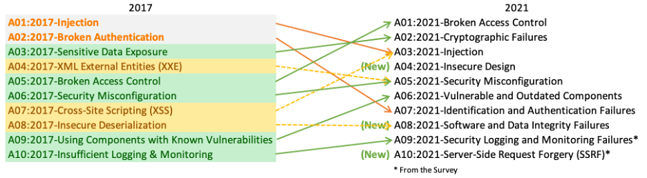

# Modern Offensive and Defensive Solutions

## Plan

* attack and defense: one hole versus every hole
* application security: ASLR, SafeStack, CFI, CET, ROP and data-oriented attacks
* OS and hardware: sandboxing, MAC, Spectre, Meltdown, rowhammer
* web: downgrade, blind injection

## Asymmetry

* the attacker needs one hole, the defender must cover all of them
* what does each side pay: time or overhead?
* where would you put a honeypot?

## Mitigations and what beats them

* DEP, so code reuse (ROP, JOP)
* ASLR, so information leaks
* canaries, so leaks and non-linear writes
* CFI, so data-oriented attacks

> **TODO (figure):** chain of mitigation and bypass, from slides.tex (no source image; draw for the room)

Question: which mitigation, if any, stops a data-oriented attack?

## Intel CET

* shadow stack: compare the return address on two stacks
* indirect branch tracking: the CPU validates jump targets
* question: why does this need OS and application support?

> **TODO (figure):** shadow stack versus normal stack on return, from slides.tex (not in source)

## SafeStack and ASan

* SafeStack: return addresses live apart from risky buffers
* ASan: finds bugs, but only in development
* question: why not ship ASan in production?

## Sandboxing and MAC

* assume the application is malware
* seccomp and iOS sandbox confine it; SELinux imposes policy
* question: why is MAC hard to maintain?

## Hardware attacks

* Meltdown and Spectre, rowhammer, IME
* KPTI separates kernel address space
* question: if the hardware is in the TCB, who can you trust?

{fig-align="center"}

Source: <https://thecustomizewindows.com/2024/06/what-are-microarchitectural-attacks/>

## Web

* connection downgrade and POODLE
* blind SQL injection: content-based and time-based
* question: how does HTTPS everywhere help against downgrade?

{fig-align="center"}

Source: <https://owasp.org/www-project-top-ten/>

## Summary

* attacks move to low-level aspects: hardware, side channels, protocols
* defense costs time and overhead
* the battle rages on
