# System Isolation

## Plan

This is the thin, in-room deck: diagrams, demo results, and the questions to put to the room.

The detailed slides are ported from the previous edition's Beamer deck
(`sis-internal/08-system-isolation/slides/slides.tex`); see the full deck.

## Confinement types

* hardware, virtual machine, process, application (SFI)
* question: which one would you use to run an untrusted codec?

## Reference monitor

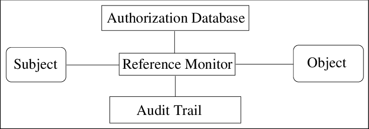{fig-align="center"}

Source: <https://www.researchgate.net/publication/2390175_Secure_Information_Flow_in_Mobile_Bootstrapping_Process>

Question: why must it always be invoked, be tamperproof and be validated?

## Mechanism and policy

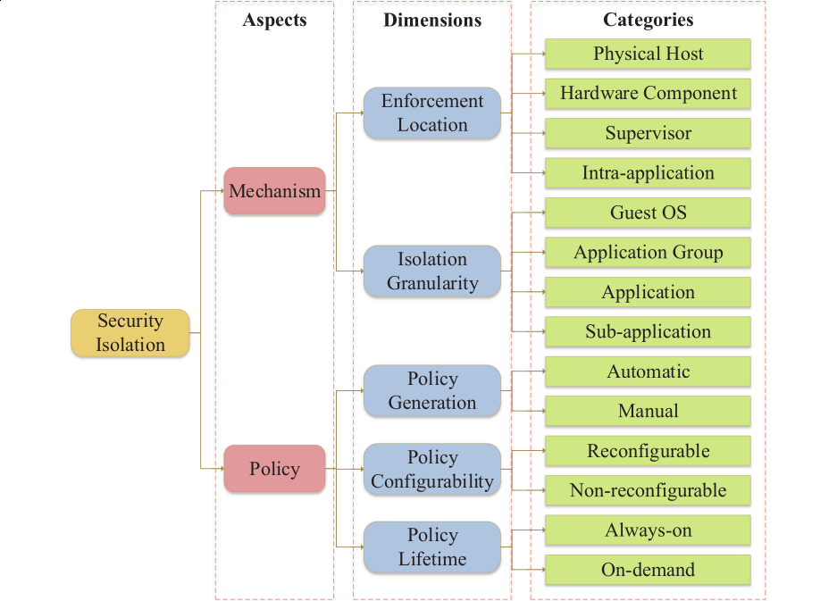{fig-align="center"}

Source: Rui Shu et al.: A Study of Security Isolation Techniques

Question: which part is implementation, and which part is configuration?

## Trusted Execution Environment

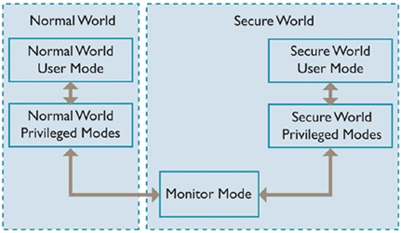{fig-align="center" width="48%"}
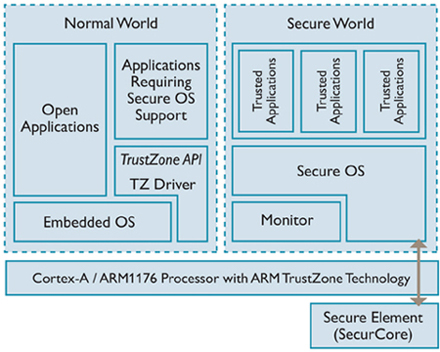{fig-align="center" width="48%"}

Source (left): <https://resources.infosecinstitute.com/topic/understanding-ios-security-part-1/>
Source (right): <https://blog.quarkslab.com/introduction-to-trusted-execution-environment-arms-trustzone.html>

Question: why keep security-specialized code out of the rich OS?

## Apple SEP

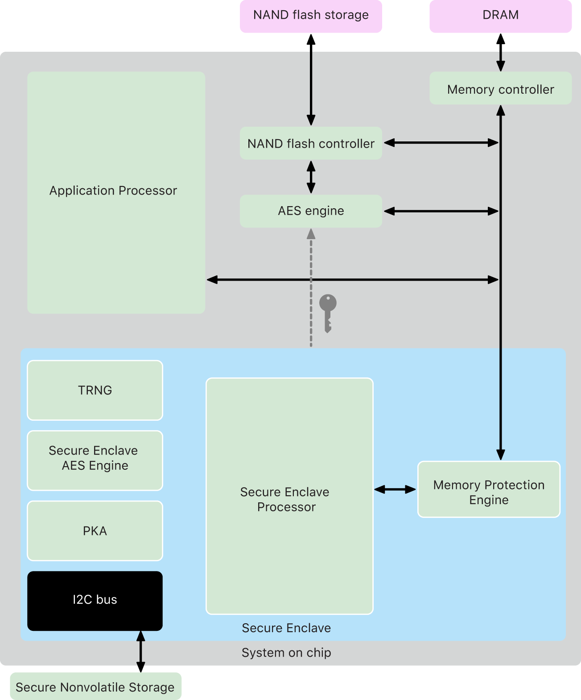{fig-align="center"}

Source: <https://support.apple.com/en-ke/guide/security/sec59b0b31ff/web>

Question: why are biometrics and keys handled only by the SEP?

## Virtualization

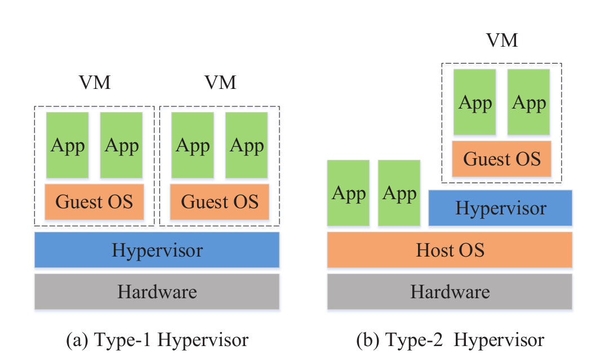{fig-align="center"}

Source: Rui Shu et al.: A Study of Security Isolation Techniques

Question: what can a side channel between two VMs reveal?

## Library OS and unikernels

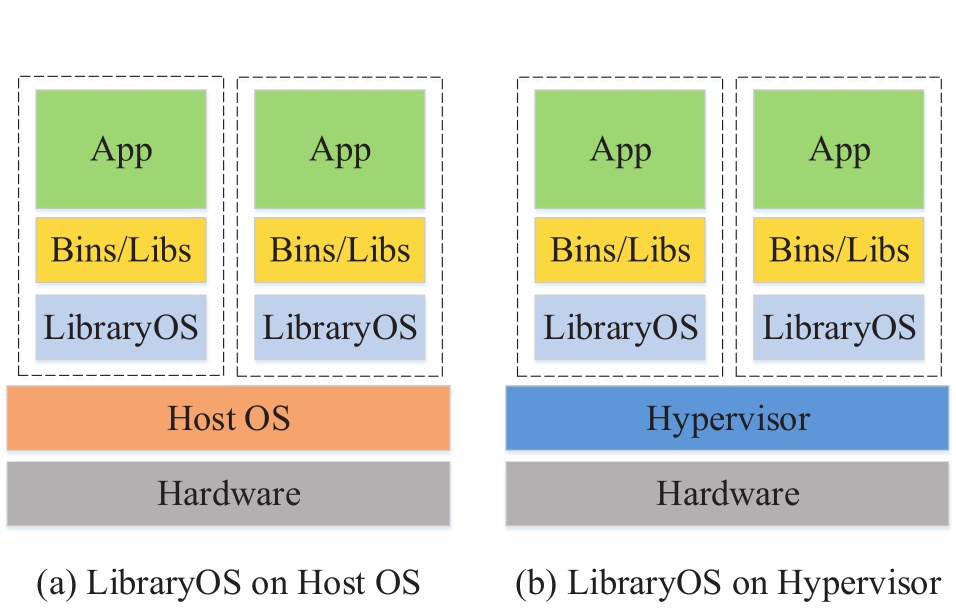{fig-align="center" width="48%"}
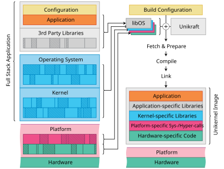{fig-align="center" width="48%"}

Source (left): Rui Shu et al.: A Study of Security Isolation Techniques
Source (right): <https://unikraft.org/docs/concepts/build-process/>

Question: why does dropping the user/kernel transition reduce the attack surface?

## Confidential computing

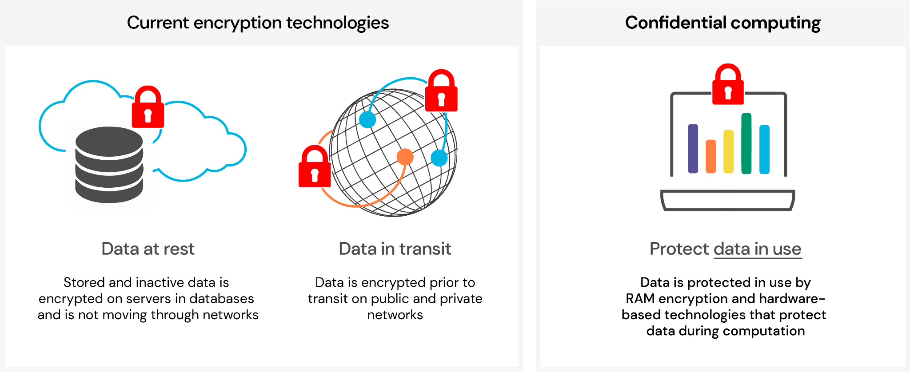{fig-align="center" width="32%"}
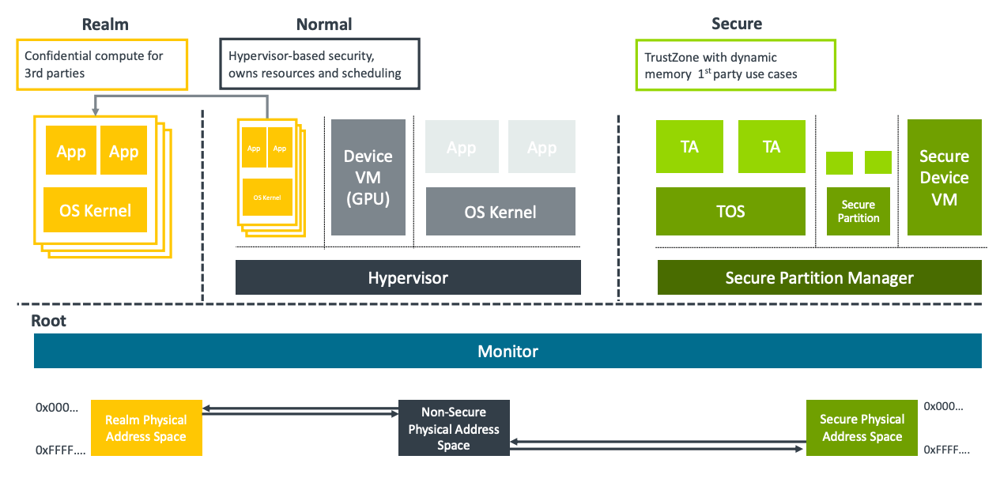{fig-align="center" width="32%"}
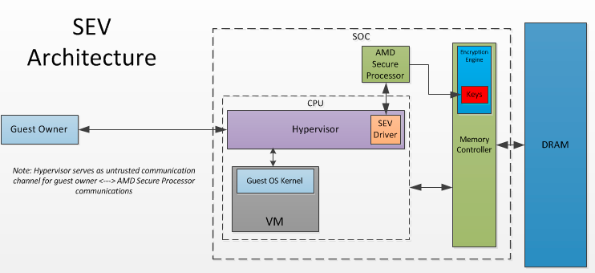{fig-align="center" width="32%"}

Question: the VM is isolated from the host; what about the host reading the VM?

## Containers

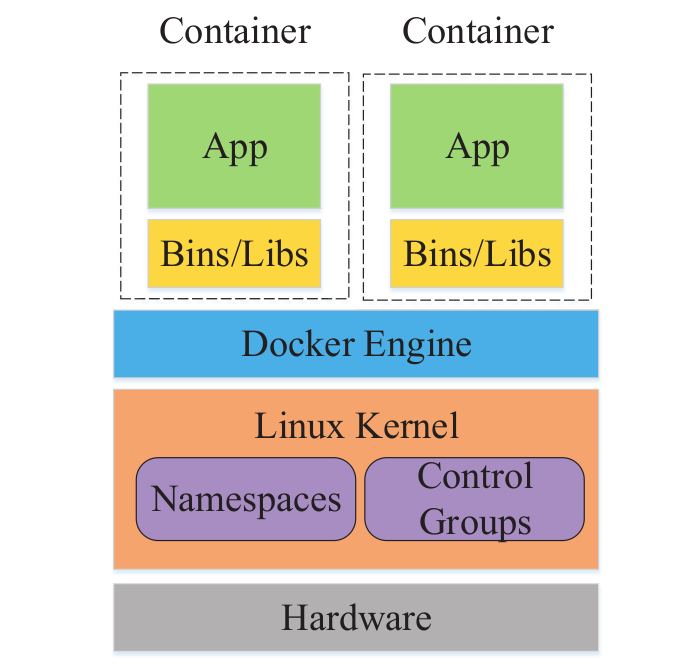{fig-align="center"}

Source: Rui Shu et al.: A Study of Security Isolation Techniques

Question: containers or hypervisors, which is more secure, and why?
