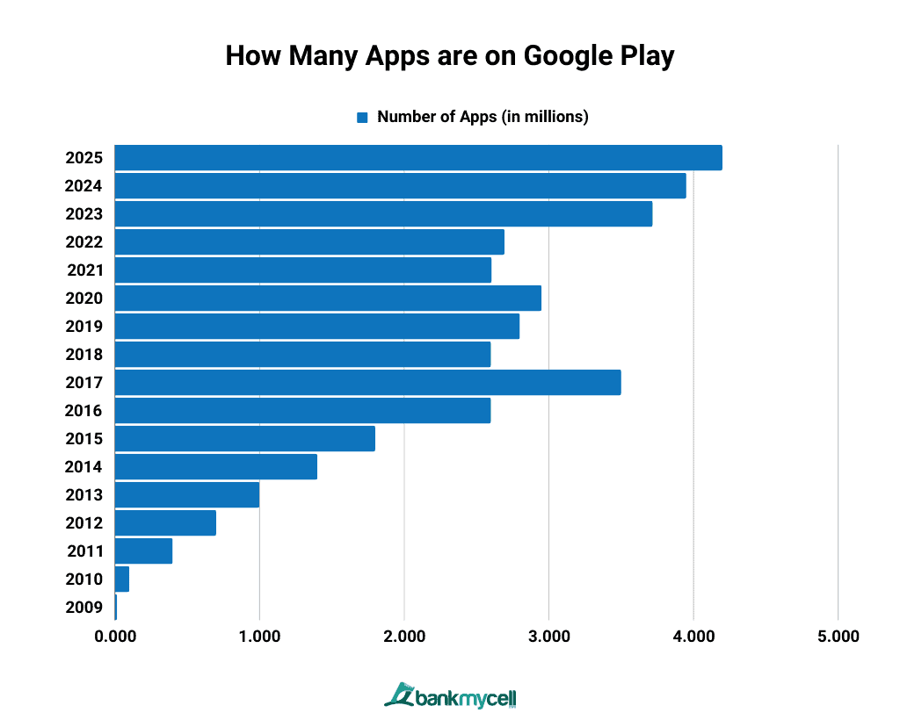
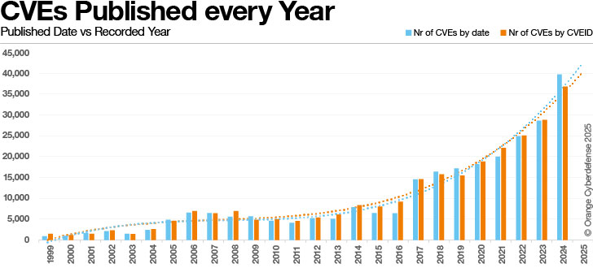
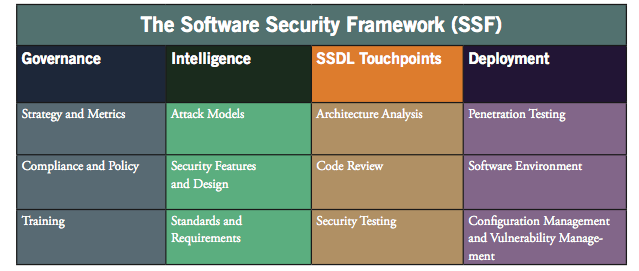
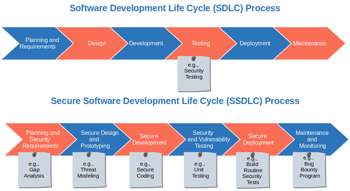

# Software Security Assurance

## Applications on Google Play

{fig-align="center"}

Source: <https://www.bankmycell.com/blog/number-of-google-play-store-apps/>

## Debian Packages

| Debian Version | Number of Packages |
| --- | --- |
| Debian 1.2 | 848 |
| Debian 8 | ~43k |
| Debian 9 | ~51k |
| Debian 10 | ~59k |
| Debian 11 | ~59.5k |
| Debian 12 | ~64k |
| Debian 13 | ~70k |

## CVEs per Year

{fig-align="center"}

Source: <https://thehackernews.com/2025/05/beyond-vulnerability-management-cves.html>

## Malware per Year

{fig-align="center"}

Source: <https://thehackernews.com/2025/05/beyond-vulnerability-management-cves.html>

## Papers

* [A survey of static analysis methods for identifying security vulnerabilities in software systems](https://ieeexplore.ieee.org/abstract/document/5386616)
* [On the capability of static code analysis to detect security vulnerabilities](https://www.sciencedirect.com/science/article/pii/S0950584915001366)

# Software Security Assurance

## Problems with Software

* Design and implementation.
* Interaction with other components.
* Environment and input optimism.
* Bugs, vulnerabilities, flaws.
* Operational issues: latency, throughput, unresponsiveness.

## Software Security Assurance

* Ensuring the security of software: proper use in potentially harmful environments.
* Design analysis.
* Secure code review, secure code analysis.
* Security testing.

## Software Security Framework

{fig-align="center"}

Source: <https://www.researchgate.net/publication/239522618_Cyber_Security_Technology_Initiatives>

## Secure Software Development Life Cycle (SSDLC)

{fig-align="center"}

Source: <https://codesigningstore.com/secure-software-development-life-cycle-sdlc>

## Software Penetration Testing

* (Ab)using the software in a realistic deployment.
* Looking for issues with an attacker mindset.
* Ethical hacking, responsible disclosure, reporting of findings.

## CI / CD

* Continuous Integration / Continuous Deployment.
* Automation of testing and deployment.
* Integrate secure testing and secure code analysis.
* Ensure the security of new features.

# Securing Software

## Ways of Securing Software

* Secure by construction: prevent the existence of bugs and vulnerabilities.
* Secure environment: prevent the exploitation of bugs and vulnerabilities.
* Isolated environment: damage control.

## Secure by Construction

* Providing it as secure (build from specs).
* Building it secure.
* Secure before shipping.

## Secure by Construction (2)

* Formal verification, provably secure.
* Programming language features.
* Programming practices.
* Defensive programming.
* Software development process.
* Code review.
* Code auditing.
* Testing.
* Fuzzing, symbolic execution.

## Common Practices and Principles

* Keep it simple: small footprint, few dependencies, no fancy hacks.
* Input validation.
* Added care when dealing with buffers and strings.
* Use linters and static checkers.
* Make code readable, document while writing.
* Simple and intuitive interfaces.
* Mindset: assume the worst.
* Do unit tests.

# Program Analysis

## Program Analysis

* Focus on applications (i.e. programs), not systems.
* Analyze program behavior.
* Performance:
  * profiling
  * reduced resource usage
  * reduced overhead
* Correctness:
  * debugging
  * security
  * robustness
* No side channel focus.

## Ways of Doing Program Analysis

* Control flow analysis: reachability.
* Data flow analysis: propagation.

## Types of Program Analysis

* Static analysis: no running of the program.
* Dynamic analysis: running the program.
* Source code analysis: source code is available, use it.
* Binary analysis: work on executables and binary files, source code may be unavailable.

## Static Analysis

* Don't run the program.
* Go through its source or binary code.
* Control flow and data flow analysis.

## Dynamic Analysis

* Monitor the process.
* Usually involves instrumentation.
* valgrind, profilers, [Pin](https://software.intel.com/en-us/articles/pin-a-dynamic-binary-instrumentation-tool).

## Source Code Analysis

* Automated, semi-automated, manual.
* Manual: code auditing.
* Programming defects, API misuse, lack of compliance, correctness.
* Software/code interpretation, pattern matching.
* Software formal verification.

## Binary Analysis

* Reverse engineering.
* Binary debugging.
* Disassembling, forensics.

# Code Analysis

## Terms

* Program comprehension: understand source code.
* Code review: fix mistakes, improve code quality and programming practices.
* Code auditing: comprehensive analysis with the intent of discovering bugs.
* Static analysis: automated action performed.

## Static Analysis (2)

* Analyze computer programs without executing them.
* Usually performed on source code.
* Automated process.

## Tools of the Trade

* Editors and reading tools.
* Pattern matching tools.
* Static analyzers.
* Pen and pad.

## Tools of the Trade (2)

* Open source:
  * [Sonar](http://www.sonarsource.org/) (Java)
  * [Flawfinder](https://dwheeler.com/flawfinder/) (C/C++)
  * RATS
  * [Clang Static Analyzer](http://clang-analyzer.llvm.org/)
  * [Splint](http://splint.org/) (C), no longer developed
  * [cppcheck](http://cppcheck.sourceforge.net/) (C, C++), plugins for IDEs
* Proprietary:
  * [Coverity SAVE](http://www.coverity.com/products/coverity-save.html)
  * [Klocwork Insight](http://www.klocwork.com/products/insight/) (C, C++, Java, C#)
  * [CodeSonar](http://www.grammatech.com/codesonar)
  * [Semmle](http://semmle.com/solutions/)
  * HP Fortify

## Binary Static Analysis

* Requires reverse engineering.
* Focused on discovering bugs and creating exploitation PoCs from them, so they can be fixed.
* Basic tools: disassemblers, symbol mappers, decompilers.
* Automated tools: Veracode, CodeSonar, BitBlaze.
* Security analysts, enhancing proprietary solutions.

# Code Auditing

## Code Auditing

* Browse source code.
* Look for security breaches and possible bugs.
* Tools for static code analysis.
* In-depth audit to be done by the developer.

## Black Box Approach

* Non-open-source code.
* Understand the protocol or user input format.
* Provide "bad" input and test possible violations.
* Reverse engineering.
* Fuzzing.

## White Box Approach

* The "real stuff": actual code auditing, highlight input processing.
* Top-to-bottom: start from main, go down the functions.
* Bottom-to-top: find all places of external input and system input, and start from there.

## Tools to be Employed

* Static analyzers (cppcheck, Clang Static Analyzer, Coverity).
* IDA for binary static analysis.
* ctags, cscope, source nav for source code navigation.
* Debuggers for runtime analysis.
* valgrind, Rational Purify for dynamic analysis.

## Code Auditor Requirements

* Know the API, OS and machine (background knowledge).
* Recognize patterns (pattern recognition).
* Understand the application (functional understanding).
* Audit all code (completeness).

## Types of Programs

* [The Mixter C guide](http://www.ouah.org/mixtercguide.html).
* setuid/setgid programs.
* Daemons and servers.
* Frequently run system programs.
* System libraries (libc).
* Widespread protocol libraries (kerberos, ssl).
* Administrative tools.
* CGI scripts, server plugins.

## Classes of Bugs to Audit

* API-based bugs.
* External resource interactions.
* Programming construct errors.
* State mechanics.

## API-based Bugs

* Misuse of OS, library or framework APIs.
* Dangerous string or formatting functions, e.g. `sprintf()`, `strcpy()`, `strcat()`, `printf()`, `syslog()`.
* Dangerous implicit behavior, e.g. allocators that round.
* Cumbersome or complicated API reference contents, e.g. threading, IPC.

## External Resource Interactions

* Privilege escalation through IPCs.
* `system()`, `execve()`, `CreateProcess()`.
* File interaction.

## Programming Construct Errors

* CWE: [Common Weakness Enumeration](https://cwe.mitre.org/data/index.html).
* Integer signedness.
* Integer boundaries.
* Checks that are logically wrong or susceptible to integer problems.
* Loops that have bad boundaries.
* Unchecked variables.

## State Mechanics

* Programs left in an inconsistent state.
* Thread safety issues.
* Async-safety issues.
* Global variables left in an undesired state.

## Methodology

* Target components, meta targeting.
* Grep targeting: won't provide understanding.
* Read code quickly and ignore what is not important:
  * copy and move data
  * input/output

## List of Issues

* Implementation bugs (miscalculation, check result, not validate input).
* Data types.
* Memory corruption.

# Defensive Programming

## Defensive Programming

* Sh*t happens.
* Assume the worst, program accordingly.
* Secure programming / secure coding.
* Offensive programming.
* Formal verification.
* Rewrite versus reuse.

## Secure Coding

* [SEI CERT C Coding Standard](https://wiki.sei.cmu.edu/confluence/display/c/SEI+CERT+C+Coding+Standard).
* Techniques for building secure programs.
* Handling input.
* Working with memory and buffers.
* Handling errors and exceptions.
* Handling data types.

## Input Validation

* Anything can be malicious.
* Look for injections.
* Take encoding into account.
* Only allow the required format.

## Buffer Management

* Start address and length.
* Boundary checking.
* Indexes.

## String Management

* Length management.
* NUL-byte termination.
* String truncation.
* Printable characters.

## Integer Management

* Conversions (size).
* Overflows.
* Signedness.

# Software Supply Chain Security

## Problems with Software (2)

* Internal to the software.
* Complex, interconnected software components.
* Due to interaction with other vulnerable components at runtime.
* The build and deployment system itself may be faulty.

## Software Supply Chain Attack

* Infrastructure could be vulnerable to misconfiguration attacks.
* External (proprietary or open source) libraries and third-party tools may be vulnerable.
* Lack of updates of libraries and third-party tools.
* Developers and operators who maliciously or inadvertently introduce vulnerabilities.

## Software Bill of Materials (SBOM)

* List all dependencies (and versions) required for building and using the software.
* Basis for validating the security of components.
* Allows automation: check vulnerabilities for versions, vulnerability scanning.

## Reproducible Builds

* An attacker attacks the build infrastructure:
  * source code not affected
  * executable affected
* Ensure the same build across different environments.
* The same executable / output.
* Prevents faults introduced by the build system.
* Multiple parties reach a consensus of identical builds.

# Summary

## Keywords

* Software security assurance
* Software security framework
* Secure software development life cycle
* Secure by design / implementation
* Program analysis
* Static analysis
* Dynamic analysis
* Source code analysis
* Binary analysis
* Code auditing
* Bugs
* Vulnerabilities
* Programming errors
* CWE (*Common Weakness Enumeration*)
* Defensive programming
* Secure coding
* Software supply chain security
* Software bill of materials
* Reproducible builds

## Resources

* [Building Secure Software](https://www.amazon.com/Building-Secure-Software-Addison-wesley-Professional/dp/0321774957)
* [Secure Coding in C and C++, 2nd edition](https://www.amazon.com/Secure-Coding-2nd-Software-Engineering/dp/0321822137)
* [SEI CERT C Coding Standard](https://wiki.sei.cmu.edu/confluence/display/c/SEI+CERT+C+Coding+Standard)
* [OWASP Secure Coding Practices Quick Reference Guide](https://www.owasp.org/index.php/OWASP_Secure_Coding_Practices_-_Quick_Reference_Guide)
* David Binkley: Source Code Analysis: A Road Map
* [CWE](https://cwe.mitre.org/data/index.html)
* [SAMATE test suite](https://samate.nist.gov/SRD/testsuite.php)
* [Secure software supply chain (CircleCI)](https://circleci.com/blog/secure-software-supply-chain)
* [Reproducible Builds](https://reproducible-builds.org/)

## References

* <http://pentest.cryptocity.net/code-audits/>
* <http://software.intel.com/en-us/articles/collection-of-examples-of-64-bit-errors-in-real-programs/>
* <http://www.ouah.org/mixtercguide.html>
* <http://www.vanheusden.com/linux/audit.html>
* <http://spinroot.com/static/>
* <http://spinroot.com/p10/>
* The Science of Code Auditing, BlackHat EU 2006
* <https://www.grammatech.com/products/binary-analysis>
* <http://bitblaze.cs.berkeley.edu/>
* <https://www.veracode.com/>
