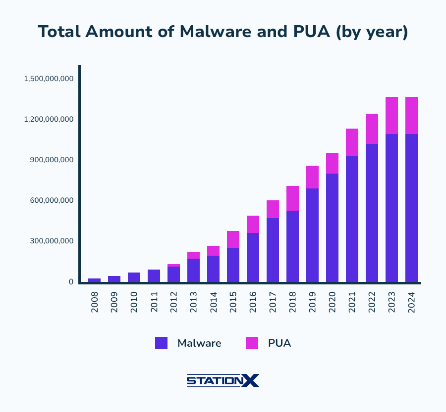

# Software Security Assurance

## Growth of software

{fig-align="center" width="32%"}
{fig-align="center" width="32%"}
{fig-align="center" width="32%"}

Question: Debian went from 848 packages (1.2) to about 70k (13); what does that do to the attack surface?

## Software security assurance

{fig-align="center"}

Question: which of design analysis, code review, security testing would you do first?

## Secure software development life cycle

{fig-align="center"}

Question: where would you plug static analysis and fuzzing into CI / CD?

## Ways of securing software

* Secure by construction.
* Secure environment.
* Isolated environment.

Question: which of the three is cheapest to get wrong, and which is cheapest to fix?

## Static versus dynamic analysis

* Static: no running of the program; control flow and data flow.
* Dynamic: monitor the process, instrumentation (valgrind, Pin).

Question: which bugs does each one miss?

## Code auditing

* Black box: bad input, fuzzing, reverse engineering.
* White box: top-to-bottom or bottom-to-top from external input.

Question: given a setuid program, where do you start reading?

## Classes of bugs to audit

* API-based bugs.
* External resource interactions.
* Programming construct errors.
* State mechanics.

Question: which class does `strcpy()` belong to? And `system()`?

## Defensive programming

* Input validation, buffer, string and integer management.

Question: what can go wrong with a length computed from user input?

## Supply chain attack

* Vulnerable or outdated dependencies.
* Faulty build and deployment infrastructure.
* Malicious or careless developers and operators.

Question: if your library is clean but your build server is not, what ships?

## SBOM and reproducible builds

* SBOM: all dependencies and versions, enables vulnerability scanning.
* Reproducible builds: same source gives the same executable, consensus between parties.

Question: how does a reproducible build expose a compromised build system?
