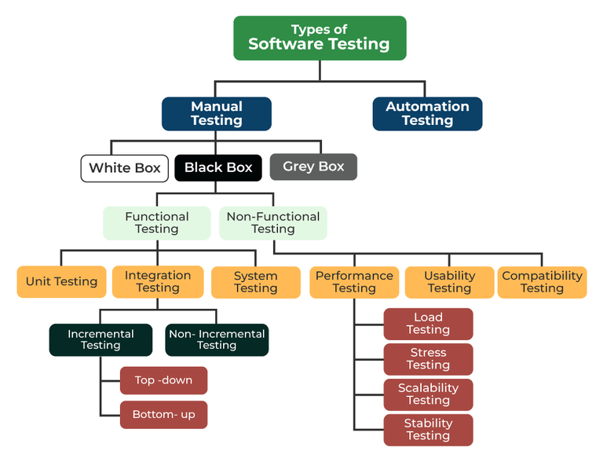
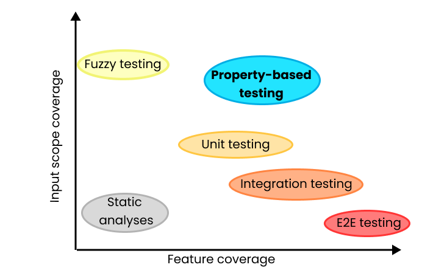
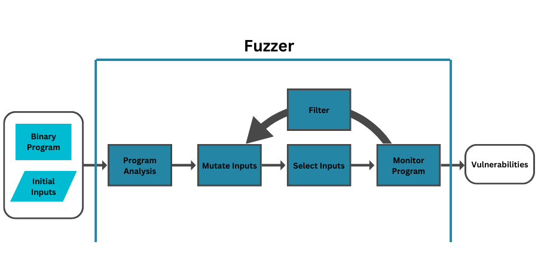
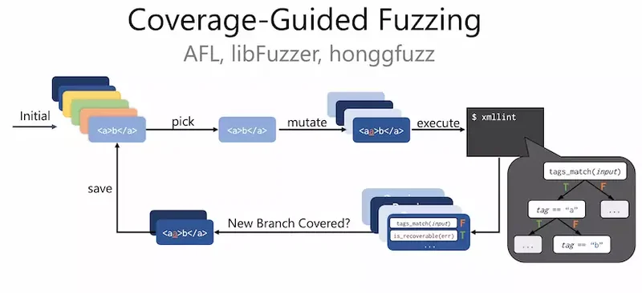
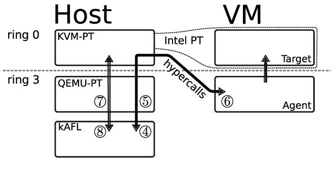

# Introduction

## Papers

* [kAFL: Hardware-Assisted Feedback Fuzzing for OS Kernels](https://nyx-fuzz.com/papers/)
* [Dissecting American Fuzzy Lop: A FuzzBench Evaluation](https://www.ndss-symposium.org/wp-content/uploads/fuzzing2022_23004_paper.pdf)

## SSDLC

{fig-align="center"}

# Overview

## Software Testing

* Validating the implementation.
* "Oracles": specification, contracts.
* Find bugs and vulnerabilities.

## Types of Testing

{fig-align="center"}

## Blackbox / Interface Testing

* Do not care about, or know, the internals.
* Validate input according to the specification.
* Send input, validate output.
* A similar approach is used by fuzzing.

## Property-based Testing

* Define a property for functions.
* Generate inputs.
* Use the inputs and "shrink" them to find issues.

## Property-based Testing vs. Fuzzing

{fig-align="center"}

## Fuzzing (as testing)

* Send quasi-random inputs.
* Collect results and failures.
* Do it automatically.
* Have a feedback loop based on results and behavior.
* Glossary: <https://github.com/google/fuzzing/blob/master/docs/glossary.md>

## Pre and Post Fuzzing

* Prepare the initial set of inputs (if any).
* Write "harnesses" (see later).
* Analyze the output (crashes).
* Fix the program.

## OSS Fuzz

* OSS Fuzz: <https://github.com/google/oss-fuzz>, <https://google.github.io/oss-fuzz/>

## Google Fuzzbench

* Google Fuzzbench: <https://github.com/google/fuzzbench>, <https://google.github.io/fuzzbench/>

## AFL

* <https://aflplus.plus/>

## libFuzzer

* <https://llvm.org/docs/LibFuzzer.html>

## honggfuzz

* <https://honggfuzz.dev/>

# Fuzzer Types

## Fuzzer Architecture

{fig-align="center"}

## Dumb vs Smart Fuzzing

* Dumb: pure random data.
* Smart: knows the data format.
* Dumb: simpler, but random.
* Smart: more complex.

## Blackbox vs Whitebox Fuzzing

{fig-align="center"}

## Fuzzer Harness

* A testing harness.
* An entry point in the program executable.
* Update the code to provide input.

## Mutation vs Generational Fuzzing

{fig-align="center"}

## Payload Fuzzing vs API Fuzzing

* Payload: create input, send it to the program, capture the output.
* The program has input functions: standard input (generally), files, sockets.
* API fuzzing: for a library, the input is sent via calls (structures).
* Do the API call, receive the output.
* Analyze crashes.

## Coverage-based Fuzzing

{fig-align="center"}

## Coverage-based Fuzzing Process

{fig-align="center"}

## GCOV, KCOV

* GCOV, the GNU coverage tool, instruments source code at build time.
* KCOV provides coverage for the Linux kernel, exposed via debugfs.
* Both are enabled at build time.
* Also bcov, lcov.

## Runtime Instrumentation Coverage

* Can also work on binary code.
* Instrument programs at runtime.
* Slower than build-time instrumentation.
* No need to rebuild.

## Using Sanitizers

* Use them for fuzzing builds.
* They force crashes to appear.
* Without sanitizers, some crashes may not appear.
* ASan, KASAN.

## Fork Server

* Start new instances per input.
* Quick start of new instances.
* Works as a "harness" to quickly get an application to serve a new input.
* Can parallelize runs.

# API / OS Fuzzing

## API Fuzzing

* Instead of a payload, construct arguments (structures).
* It is similar to a set of payloads.
* Make a call to a function with arguments, instead of sending a payload.
* Receive the function return value, instead of looking at the output.
* Still aim to capture crashes.

## Restler

* <https://github.com/microsoft/restler-fuzzer>
* Stateful REST API fuzzing tool.
* Fuzzes services.
* Steps: definition, test endpoints, fuzz.

## Restler (2)

{fig-align="center"}

## OS Fuzzing

* Fuzz the OS syscall interface.
* Run inside a virtual machine.
* Have some sort of manager interface to capture crashes and restart virtual machines.
* How to capture coverage?

## Syzkaller

{fig-align="center"}

## kAFL / Nyx

* KVM-based.
* Use Intel PT (processor trace) for coverage.
* No build-level coverage part required.

## kAFL

{fig-align="center"}

## Nyx

{fig-align="center"}

## k/FX

* <https://github.com/intel/kernel-fuzzer-for-xen-project>
* Kernel fuzzer.
* Uses Xen, VMI, AFL.

# State of the Art

## Cyber-Reasoning Systems (CRS)

* Fully autonomous.
* Analyze a system, detect vulnerabilities, create exploits, self-heal.
* Combine fuzzing, symbolic execution and other techniques.
* DARPA Cyber Grand Challenge 2016: <https://www.darpa.mil/program/cyber-grand-challenge>

# Summary

## Keywords

* SSDLC
* software testing
* fuzzing
* smart fuzzing
* dumb fuzzing
* whitebox fuzzing
* blackbox fuzzing
* Google Fuzz Project
* AFL
* libFuzzer
* Honggfuzz
* mutations
* generational fuzzing
* initial corpus
* harness
* coverage
* payload fuzzing
* API fuzzing
* Restler
* Syzkaller
* kAFL
