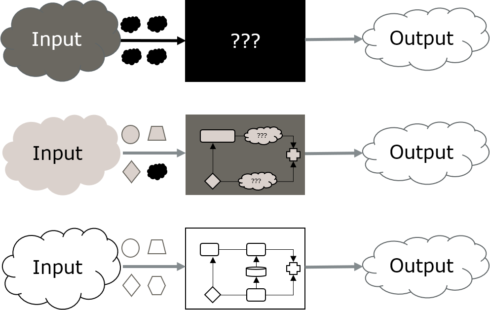
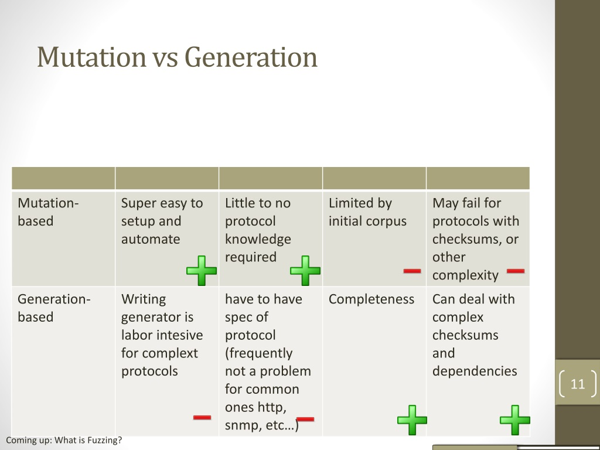
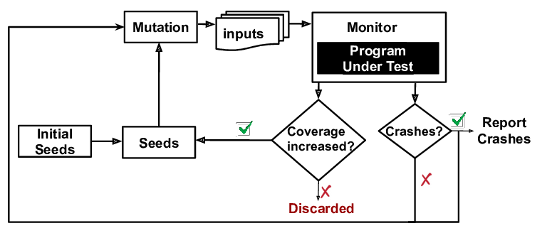
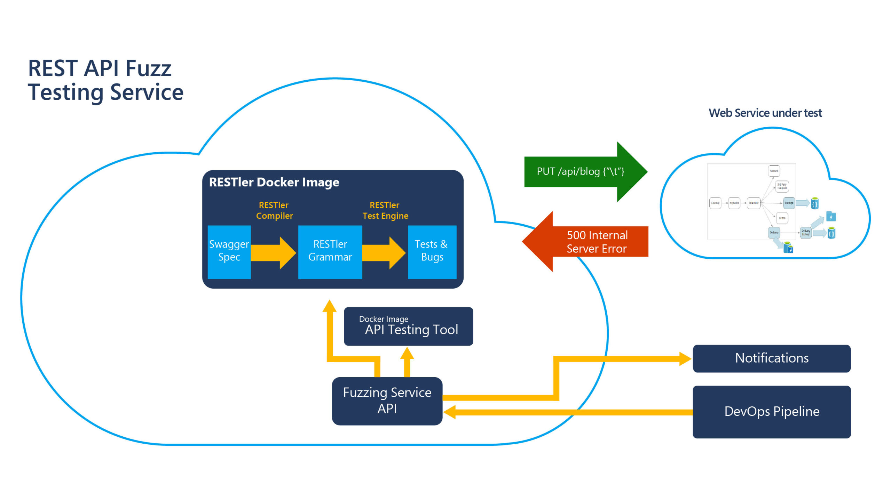
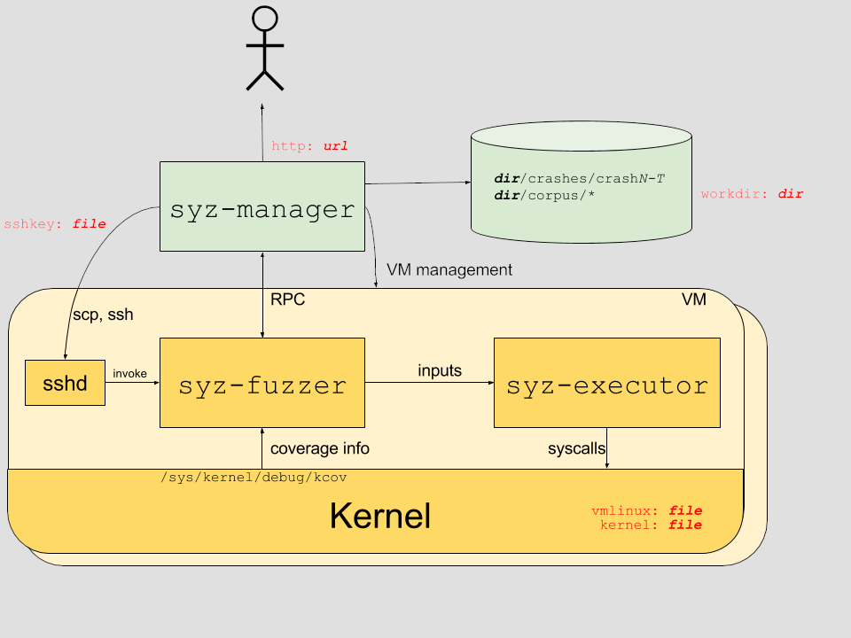
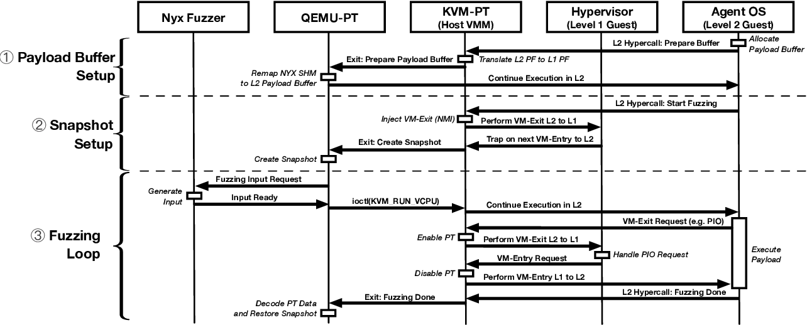

# Fuzzing

## Fuzzing as testing

* send quasi-random inputs, collect failures, with a feedback loop
* question: how is this different from the unit tests you already write?

## The SSDLC

{fig-align="center"}

Question: where in this cycle does fuzzing fit?

## Property-based testing vs. fuzzing

{fig-align="center"}

## Fuzzer architecture

{fig-align="center"}

Question: which component decides what the next input is?

## Blackbox vs whitebox

{fig-align="center"}

## Mutation vs generation

{fig-align="center"}

Question: when would you pick generation over mutation?

## Coverage-guided fuzzing

{fig-align="center"}

Question: why does coverage feedback beat purely random inputs?

## Harness and sanitizers

* harness: an entry point that feeds the input to the code
* sanitizers (ASan, KASAN) force silent bugs to crash
* question: what would a fuzzer miss without a sanitizer?

## Restler

{fig-align="center"}

## Syzkaller

{fig-align="center"}

Question: how do you capture coverage inside a kernel?

## kAFL and Nyx

{fig-align="center"}

{fig-align="center"}

## Cyber-reasoning systems

* fully autonomous: find vulnerabilities, exploit, self-heal
* question: what can a CRS do that a fuzzer alone cannot?
