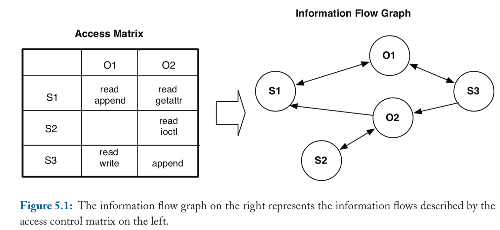

# Information Flow

## Information Flow

* Data transfer from a variable or location to another one.
* It is part of a system or process.
* The goal is to make guarantees about the propagation of data.
* Information flow is secure if the attacker is unable to deduce information about hidden data from the observable (leaked) outputs of the process.

## Privilege Levels

* High and low privilege or integrity.
* Levels are assigned to information.
* There is no transfer from high to low.
* E.g. root and non-root processes.
* E.g. unsandboxed and sandboxed processes.
* E.g. system apps and 3rd party apps.
* Access control is not enough: what happens with the data after access has been granted?
* Crypto is not enough: what happens with the data after decryption?

## Information Flows

* Explicit: assignments.
* Implicit: side-channels.

## Information Flow Checking (IFC)

* Runtime: tag data.
* Static analysis.
* Use a security type system enforcing security properties, at programming language level.
* Implemented at programming level and OS level.

## Dynamic Information Flow Checking (DIFC)

* Monitor data in the program.
* Fail if a violation is reached.
* "Scope creep": the security context grows.

## Static Information Flow Checking (SIFC)

* Potential full coverage.
* No "scope creep".

# Process Level

## Process Level

* Assume each process or application is secure.
* Track data between processes.
* Input-output, kernel enforcement.

## Reference Monitor

* The classical access enforcement mechanism.
* A secure OS satisfies the reference monitor concept.
* Complete mediation.
* Tamperproof.
* Verifiable.

## Information Flow at OS-level

* A subject s performs a read or write operation on an object o.
* There is an information flow between s and o.

## Information Flow Graph

{fig-align="center"}

Source: Trent Jaeger, *Operating System Security*, Chapter 5. Verifiable Security Goals.

## The Bell-LaPadula Model

* Focuses on confidentiality (not including integrity).
* Military and governmental.
* Levels: top secret, secret, confidential, unclassified.
* Low cannot read from high (read down).
* High cannot write to low (write up).
* Trusted Subjects transfer from high to low.

## Biba Integrity Model

* Focused on integrity: prevent modification and corruption.
* High cannot read from low (read up).
* Low cannot write to high (write down).

## Clark Wilson Integrity Model

* Focused on integrity.
* Authenticated principal (user), set of programs (TP), data items.
* Certification rules and enforcement rules.

## Covert Channels

* Side channels.
* Implicit communication channels.
* Communication outside the control of the reference monitor.
* Storage channel: can theoretically be completely removed.
* Timing channel: cannot be completely removed.
* Fuzzy time (randomizing behavior).
* Non-interference.

# Decentralized Information Flow Control

## Decentralized Information Flow Control

* Share data with distrusted code.
* Suited for complex systems, for which a centralized model is unattainable.
* Labels annotate code.
* Checking can be done by the compiler, similar to type checking.

## Implicit Information Flow

```text
x := 0
if b then
    x := 1
end
```

## Language-level Information Flow Control

* Left as a placeholder (TODO) in the source deck.

## OS-level

* Asbestos, HiStar, Flume.

# Fine-grained Dynamic Information Tracking

## Fine-grained Tracking

* Left as a placeholder (TODO) in the source deck.

## Taint Analysis

* Left as a placeholder (TODO) in the source deck.

## Perl Taint Tracking

* Left as a placeholder (TODO) in the source deck.

## Taint Analysis Solutions

* Left as a placeholder (TODO) in the source deck.

# Summary

## Summary

* Left as a placeholder in the source deck (a note about "the story with the languages").

## Keywords

* Left as a placeholder (TODO) in the source deck.

## Resources

* Pin
* shell-storm
* Perl taint tracking
* Triton
* <https://web.cecs.pdx.edu/~apt/cs491/collins_presentation.html>
* <https://www.cs.uoregon.edu/research/summerschool/summer03/lectures/flow.pdf>
* <http://www.csc.kth.se/utbildning/kth/kurser/DD2460/Slides/trans_slides_SSS-part-3_lect-1_information-flow-security.pdf>

## References

* Trent Jaeger: Operating System Security
* Bell LaPadula
* Biba and Clark Wilson
* Andrew Myers
* Jif
* Asbestos
* HiStar
* Flume
* Aquifer
* Weir
* TaintBochs
* Panorama
* TaintDroid
* FlowDroid
* Dorothy Denning: A Lattice Model of Secure Information Flow
