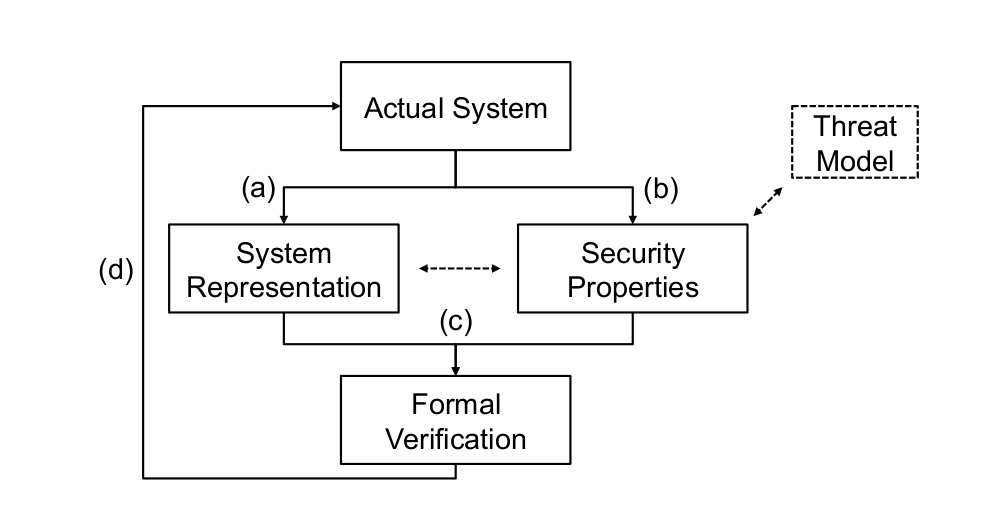
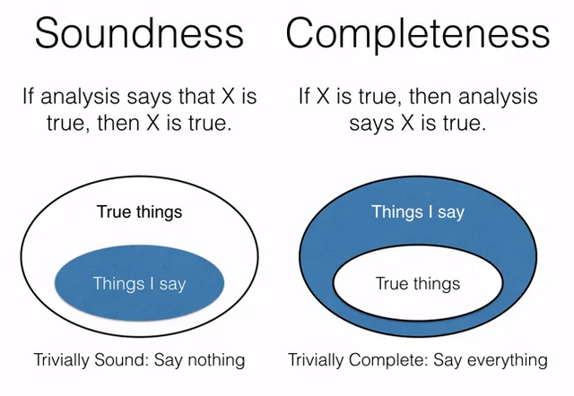
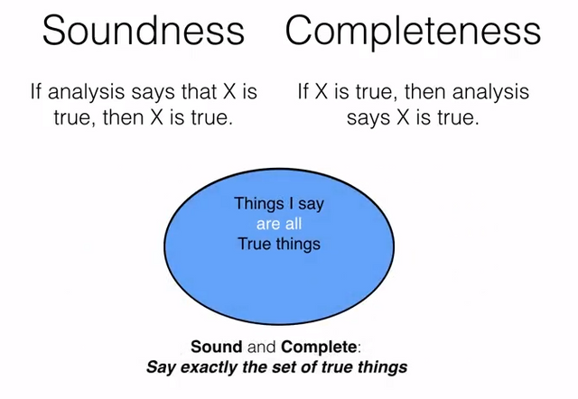

# Software Verification

## Securing Software

* verification
* code analysis
* fuzzing
* testing
* monitoring

## Software Verification

* before/during implementation
* system model/specification
* security properties
* formal verification

## Software Verification: Procedure

{fig-align="center"}

## System Representation

* HDL (for hardware)
* high-level programming languages
* system model
* difficult to prove equivalance between system model and the actual system (i.e. implementation)

## Security Properties

* confidentiality, integrity, availability
* non-interference
* isolation
* information flow
* type and memory safety
* memory integrity
* code integrity

## Algorithm vs Implementation

* algorithm verification is mostly theoretical / formal
* implementation is particular to the environment: programming language, operating system, hardware
* out-of-algorithm components need to be considered when evaluating implementation

## Runtime Verification

* monitoring
* detecting and correcting malfunction
* recovery code/functions

# Formal Verification

## Deductive vs Algorithmic Mechanisms

* deductive: logical formulas limiting system states throughout execution, relations between states
* algorithmic: invariants in the system, i.e. values, variables that are valid among all execution paths

## Formal Verification via Deductive Mechanisms

* general property verification
    * deduce properties from system model
    * represent properties in a theorem prover
    * prove system S fits a given property P
    * any system represented as S can be verified against that property P
* individual verification
    * verify each system
    * no need to formally define a security property as P
    * method is not general
* Coq, Isabelle, pen-and-paper

## Formal Verification via Algorithmic Mechanisms

* done on system representation and states
* model checkers, SMT solvers, symbolic execution

## Model Checking

* given a finite-state model, check that a property holds
* define property as a logical formula
* do checks using invariants, pre-conditions and post-conditions
* state explosion
* easy to do on hardware
* SPIN (PROMELA)

## Model Checking on Software

* complex model of programs
* path explosion because of loops
* unrealistic to cover everything

## Bounded Model Checking

* cut off traversal depth, reduce number of steps
* can be repeated for larger and larger depths
* unwinding assersions

## SMT Solvers

* Satisfiability Modulo Theories
* translate systems into logical formulas
* SMT formula validates a property against translated logical formulas
* Z3, Boogie

## Symbolic Execution

* symbols used instead of actual values
* simulate execution
* path explosion
* used by all model checkers

## Limitations

* completeness: what properties do we want to verify
* design/algorithm vs implementation
* system complexity

## Pre and Post-Conditions

* typically stated as requires and ensures
* program is modeled and conditions are checked against the program
* example from HIP / SLEEK

## Soundness and Completeness

* soundness: everything that is provable is true
* completeness: all true sentences are provable

## Soundness and Completeness (2)

{fig-align="center"}

## Soundness and Completeness (3)

{fig-align="center"}

# Summary

## Keywords

* verification
* system / application model
* security properties
* deductive approach
* algorithmic approach
* model checking
* bounded model checking
* SMT solvers
* pre and post-conditions
* soundness
* completeness

## Resources

* Survey of Approaches for Security Verification of Hardware/Software Systems

## References

* <https://steemit.com/software/@cpuu/the-difference-between-soundness-and-completeness>
