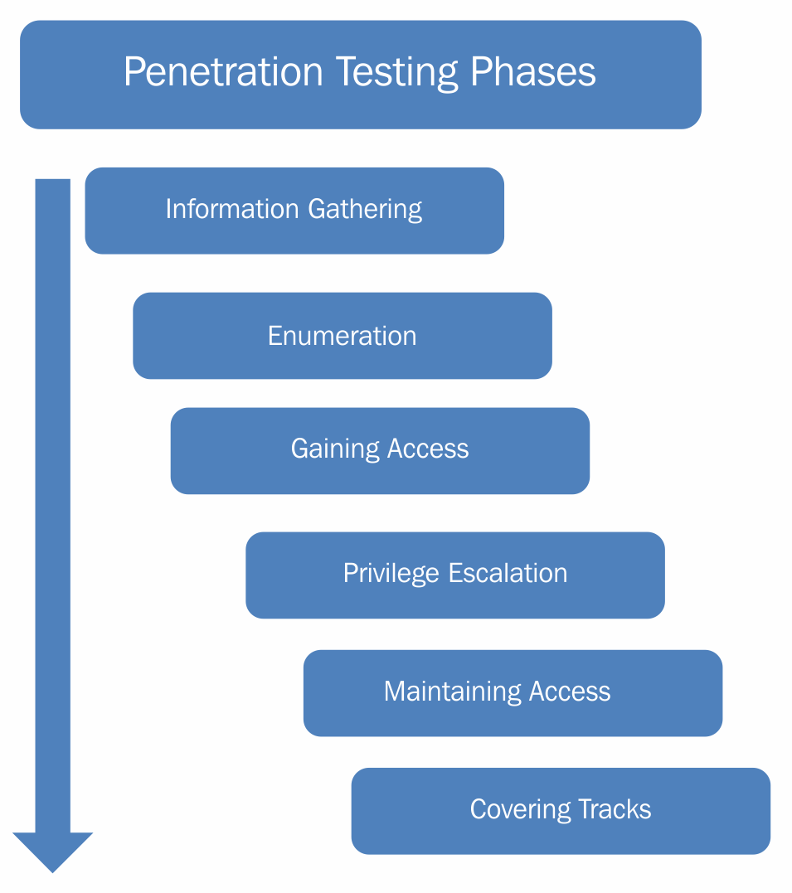

# System Auditing

## Cloud computing risks

> **TODO (figure):** cloud computing risks — from slides.tex

Question: which of these risks can an audit actually detect?

## Security audit costs

> **TODO (figure):** security audit costs — from slides.tex

Question: what does it cost not to audit?

## Test, assess, audit

* test: does it work?
* assess: does it match the expectation?
* audit: do procedures and policies hold, are we compliant?
* question: which of the three is a penetration test?

## What do we audit on a system?

* filesystem, databases, accounts and passwords
* network services, applications, kernel, hardware
* question: what would you check first on an unknown machine?

## auditd flow

> **TODO (figure):** Linux audit flow — from slides.tex

Question: where in this flow are the rules applied?

## auditd components

* `auditd`, `auditctl`, `augenrules`, `ausearch`, `aureport`
* question: how would you find who read a given file?

## Windows counterpart

* Security Logs, viewed in the Event Viewer
* question: how does this compare to auditd?

## PenTest phases

{fig-align="center"}

Question: how do the attack phases map to the pentest phases?

## Ethical hacking

* same tools as black hat hackers
* approval from the owner of the targeted system
* question: what separates a pentest from an attack?
